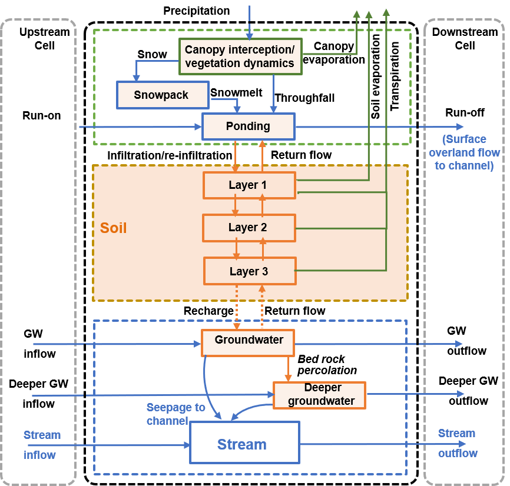

.. |ech2o| replace:: EcH\ :sub:`2`\ O

|ech2o|-iso 3.0
===============

|ech2o|-iso builds on the **physically-based, spatially distributed ecohydrologic model EcH**\ :sub:`2`\ **O** developed in C++ in the Regional Hydrology Lab at the University of Montana (Maneta and Silverman, 2013) (`link <http://hs.umt.edu/RegionalHydrologyLab/software/default.php>`_).

The specifity of |ech2o|-iso is the implementation of stable water isotopes (:sup:`2`\ H and :sup:`18`\ O) and age tracking.
It is mostly based on an immediate, complete implicit scheme for mixing water transiting between compartments within time steps (Fig. 1).
Evaporative fractionation of isotopes is also included.

   **Figure 1.** Water compartments and fluxes as represented in |ech2o| and used for isotope and age tracking in |ech2o|-iso. Note that the Deeper groundwater storage is newly added by Yang et al., 2021 WRR  

Main modifications for larger scale modeling 
------------------

- An input map of areal proportion of each modeling cell was added, given that the boundary cells might not be fully covered by the catchment domain.
- Topographic characteristics (i.e., slope, drainage network, stream morphology) could not be derived directly from a resampled digital elevation model (DEM) due to the coarse resolution at the modeling level (e.g., 1 km2). Therefore, first, the main drainage line of each modeling cell was derived according to the flow direction (D8 algorithm) and flow accumulation at the finer resolution DEM (e.g., 100 m); Second, the drainage direction at the 1 km2 model resolution was assigned as the flow direction of the outlet of the main drainage line, and the slope was calculated as the elevation difference between the inlet and the outlet, divided by the main drainage length.
- For a better representation of spatial variability, multiple soil types and land cover types were allowed for each modeling cell (rather than one soil or land cover type for each cell). This was supported by using input maps of type-specific areal proportions.
- For grid cells with channels, the surface ponded water was partitioned into surface overland flow draining to the down-slope cell and surface overland flow to the channel, according to their relative lengths. Importantly, re-infiltration of the surface run-on into the first soil layer and the subsequent vertical tracer mixing throughout the soil profile was activated, especially as the modeling resolution was coarse and the river network was relatively dense.  

|ech2o|-iso Documentation
-------------

The documentation for installing an runnnig |ech2o|-iso, available as of the date of this release, can be found on its `ReadTheDocs webpage <http://ech2o-iso.readthedocs.io/en/latest/>`_.
  
Data Preprocessing
------------------

|ech2o|-iso uses the PCRASTER map format (a cross-system format) for data pre- and post-processing, and for visulalization. 
PCRASTER can be downloaded free of charge from http://pcraster.geo.uu.nl/downloads

How to Cite
-----------
Please, acknowledge the use of this version of |ech2o|-iso by citing:
- Yang, X., Tetzlaff, D., Müller, C., Knöller, K., Soulsby, C., & Borchardt, D. (2022). Upscaling Tracer-aided Ecohydrological Modeling to Larger Catchments: Implications for Process Representation and Heterogeneity in Landscape Organization (Under review)
- Yang, X., Tetzlaff, D., Soulsby, C., Smith, A., & Borchardt, D. (2021). Catchment functioning under prolonged drought stress: tracer-aided ecohydrological modeling in an intensively managed agricultural catchment. Water Resources Research, 57, e2020WR029094. https://doi.org/10.1029/2020WR029094
- Maneta, M and Silverman, N (2013). A spatially-distributed model to simulate water, energy and vegetation dynamics using information from regional climate models. Earth Interactions, 17, 1-44.
- Kuppel, S., Tetzlaff, D., Maneta, M. P., and Soulsby, C. (2018). |ech2o|-iso 1.0: Water isotopes and age tracking in a process-based, distributed ecohydrological model, Geosci. Model Dev., 11, 3045-3069, `<https://doi.org/10.5194/gmd-11-3045-2018>`_.

Licensing
---------

Please see the file called LICENSE.txt.

 
Contacts
--------

If you have any questions regarding the upscaling modifications, contact xiaoqiang.yang@ufz.de.
